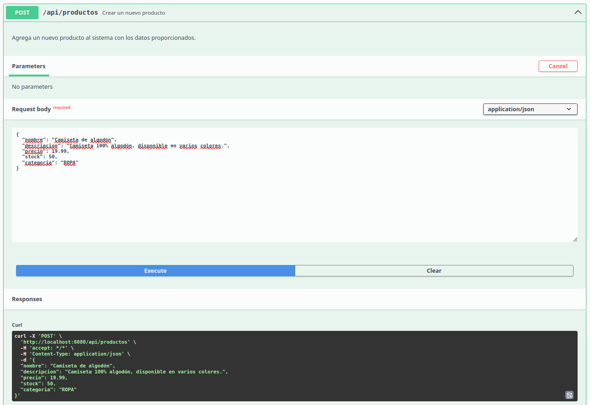
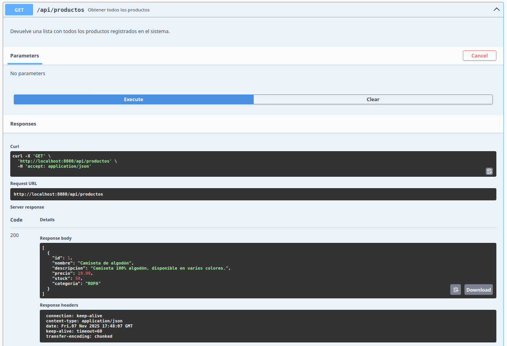
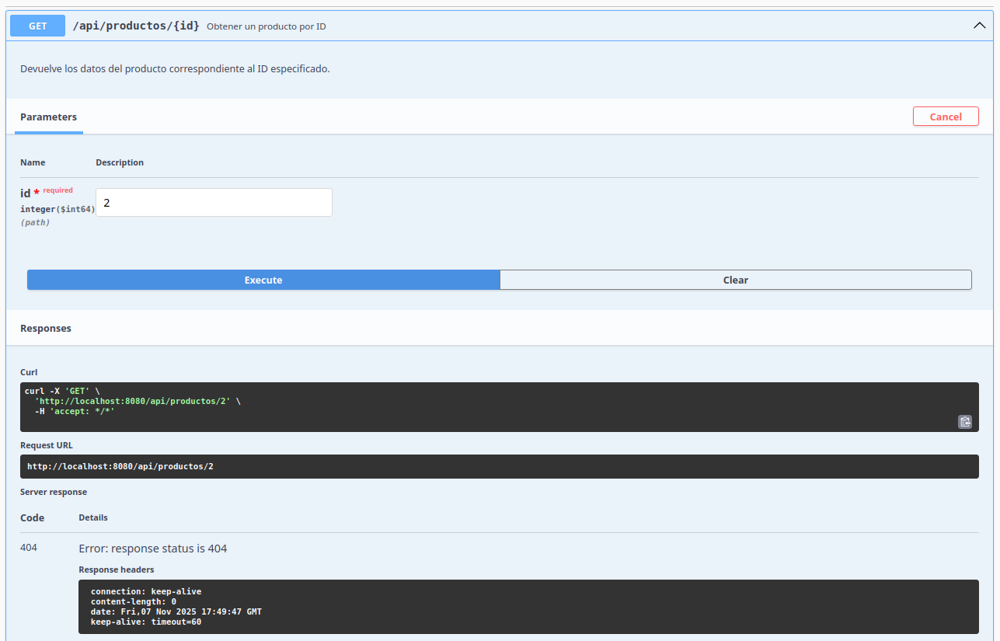
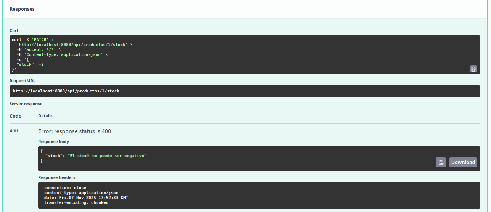
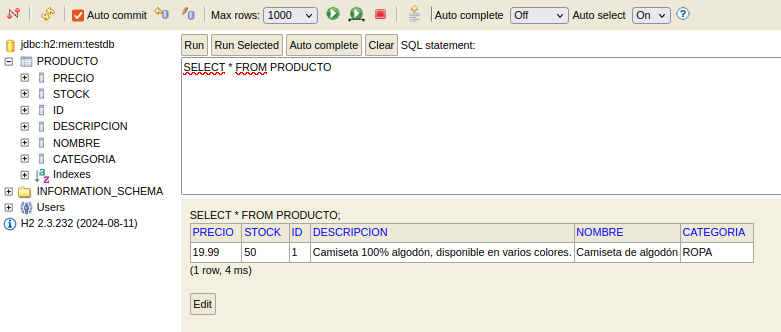

# Sistema de Gestión de Productos - Spring Boot

## Descripción del Proyecto

Este proyecto es una API REST desarrollada con **Spring Boot** que permite gestionar productos dentro de un sistema.  
Incluye operaciones CRUD completas, validaciones mediante `Jakarta Validation`, manejo global de excepciones y documentación automática con **Swagger / OpenAPI**.  
Además, utiliza una base de datos **H2 en memoria**, ideal para entornos de desarrollo y pruebas, mostrando cómo persistir y consultar datos de manera rápida y sencilla.

---

## Tecnologías Utilizadas

| Tecnología | Descripción |
|-------------|-------------|
| **Java 17+** | Lenguaje de programación principal |
| **Spring Boot 3.x** | Framework backend para desarrollo ágil |
| **Spring Web** | Creación de controladores REST |
| **Spring Validation** | Validación de DTOs con anotaciones |
| **Springdoc OpenAPI (Swagger UI)** | Documentación interactiva de la API |
| **H2 Database** | Base de datos en memoria para pruebas |
| **Lombok** | Reducción de código boilerplate |
| **Maven** | Gestión de dependencias y build |

---

## Instrucciones para Clonar y Ejecutar

### 1. **Clonar el repositorio**
```bash
git clone https://github.com/LuisFerre1ra/RESTSpringboot.git
cd RESTSpringboot
```

### 2. **Compilar el proyecto**
```bash
mvn clean install
```

### 3. **Ejecutar la aplicación**
```bash
mvn spring-boot:run
```

La aplicación estará disponible en:
```
http://localhost:8080
```

---

## 🌐 Endpoints Disponibles

| Método | Ruta | Descripción |
|--------|------|-------------|
| `GET` | `/api/productos` | Obtener todos los productos |
| `GET` | `/api/productos/{id}` | Obtener un producto por ID |
| `GET` | `/api/productos/categoria/{categoria}` | Filtrar productos por categoría |
| `POST` | `/api/productos` | Crear un nuevo producto |
| `PUT` | `/api/productos/{id}` | Actualizar un producto existente |
| `PATCH` | `/api/productos/{id}/stock` | Actualizar solo el stock de un producto |
| `DELETE` | `/api/productos/{id}` | Eliminar un producto por ID |

---

## 📸 Capturas de Pantalla

### 1. Documentación completa en Swagger UI


### 2. Prueba exitosa de POST (creando producto)


### 3. Prueba de GET (listando productos)


### 4. Error 404 - Producto no encontrado


###  5. Error 400 - Validación fallida


###  6. Consola H2 mostrando datos persistidos


---

## 🔗 Accesos Rápidos

| Recurso | URL |
|---------|-----|
| **Swagger UI** | [http://localhost:8080/swagger-ui/index.html](http://localhost:8080/swagger-ui/index.html) |
| **Consola H2** | [http://localhost:8080/h2-console](http://localhost:8080/h2-console) |

### Credenciales de la Consola H2

En la consola H2 usa las siguientes credenciales (por defecto):

- **JDBC URL:** `jdbc:h2:mem:testdb`
- **Usuario:** `sa`
- **Contraseña:** _(vacía)_

---

## Conclusiones Personales

Durante el desarrollo de este proyecto aprendí a:

- Diseñar controladores REST aplicando buenas prácticas con `ResponseEntity` y validaciones.
- Implementar un manejo global de errores con `@ControllerAdvice` y `@ExceptionHandler`.
- Documentar de forma profesional una API con Swagger/OpenAPI.
- Comprender la importancia de separar capas (controlador, servicio, entidad y DTO).
- Usar la base de datos H2 para pruebas sin depender de un servidor externo.

Este proyecto me permitió afianzar conceptos fundamentales de desarrollo backend en Spring Boot.

---

## Autor

**Nombre:** Luis Ferreira 

**Legajo:** 50896

**Carrera:** Ingeniería en Sistemas
